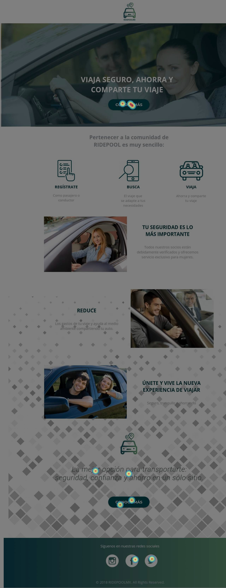

# RidepoolMx

Es una plataforma de transporte colaborativo donde podrás compartir tu auto y reducir costos, si eres pasajero también podrás ahorrar;todo esto con la seguridad de que viajas con usuarios 100% verificados.

# RETO
Entender y optimizar el journey de tomar 
un camión de CDMX <> Cuernavaca.

# EQUIPO

**Product Owner:** Karina Quezada
**UX Researcher:** Marisol Juárez y Joali Gamboa
**UX Designer:** Adriana Dillarza

# PLANIFICACION
Para este reto el equipo llevo su proceso a través de Trello 

# OBJETIVO DE NEGOCIO

Lo primero que debimos establecer antes de comenzar nuestro proceso fue establecer un objetivo el cual fue:

**Ofrecer mayor seguridad a los usuarios(pasajeros/conductores) del servicio de Blablacar a través de la formalización del servicio, sin tener que afectarlos en la economía de su viaje**

# PROCESO

Para este proyecto seguimos el siguiente proceso

## Empatizar

Se debe entender al usuario o al cliente para poder darle una solución asus necesidades esto lo logramos a partir del mapa de empatía; donde definimos a nuestros dos usuarios.

En este caso nos enfocamos al conductor y al pasajero que son quienes van a a usar nuestro servicio, con ello definimos las siguientes características:

# Usuario 

* Sentimientos: Hay demasiadas plataformas y líneas de autobuses pero no hay opciones muy económicas

* Tareas:El usuario quiere viajar de forma económica de CDMX a Cuernavaca

* Influencias: La necesidad de llegar a Cuernavaca y el bombardeo de publicidad de los diferentes tipos de transporte

* Pain points:Economía, seguridad. 

* Objetivos:El usuario quiere llegar a su destino en tiempo y forma con lo establecido en su horario

# Conductor

* Sentimientos: Puedo compartir mi auto y compartir los gastos de gasolina y casetas.

* Tareas: Hacer el viaje a Cuernavaca y si puede compartirlo que mejor

* Influencias:La gente que viaja hacia el mismo destino 

* Pain Points:Gastos del viaje

* Objetivos:Compartir el auto y los gastos del viaje,así como ayudar en el medio ambiente

En base al mapa antes mostrado se decidió realizar una encuesta los resultados se muestran a continuación:

## Retos de investigación

Se tuvieron algunas dificultades al realizar esta encuesta:

* Se tuvieron algunos problemas en la recopilación de datos.
* No se hicieron obligatorias las preguntas
* Se dejaron muy abiertas algunas de las opciones planteadas en las respuestas
* Omitimos preguntas importantes como el género de los usuarios

## Primeros Insights

A pesar de esos retos tambien conseguimos los siguientes insights:

* Los usuarios creen necesario pagar una penalización en caso de cancelar un viaje
* A los usuarios les gustaría recibir artículos promocionales o recompensas al utilizar el servicio

# DEFINIR

Después de analizar los resultados de la encuesta as+i como los insights resultantes se decidió que en lugar de mejorra el servicio de Bla Bla Car se crearía una empresa nueva que ofreciera la seguirar y confianza que el servicio existente no ofrece.

## Enunciado del problema

Hay usuarios que buscan ahorrar en sus viajes CDMX-Cuernavaca tanto en transportarse como en reducir los gastos de su viaje por carretera; a su vez buscan viajar seguros.

## Necesidades de usuario

Se decidió seguir trabajando con los pefiles de conductor y pasajero

 **Conductor**

* Aprovechar los lugares disponibles de su auto
* Ahorrar en los gastos del viaje
* Viajar con acompañantes confiables
* Reducir contaminación

**Pasajero**
* Ahorra en su transporte
* Transportarse seguro
* Puntualidad en sus viajes

## Objetivo de Negocio Replanteado

Al haber descubierto que era más conveniente ser competencia del servicio existente debimos replantear nuestro objetivo de negocio el cual se estableció en:

**"Hacer que se registren pasajeros y conductores para que la plataforma crezca con usuarios verificados."**

## Insights Finales

Con el objetivo bien definido pudimos obtener insights que definieron el proyecto los cuales son:

* Los usuarios (pasajero/conductor) consideran importante que el servicio sea seguro al ser un transporte compartido.
* Creen que es necesario que exista una penalización en caso de la cancelación de su viaje.
* Les gusta la idea de economizar hasta en un 50% de cada viaje.

# IDEAR

Ya con toda la información recopilada en las etapas anteriores se comenzó a idear como sería y como funcionaría la solución

## Nombre de la solución

El equipo debió decidir el nombre de la nueva compañía el cual debia indicar de que trataba la solución (Viajes colaborativos) y que no fuera usado en el país.

Con esto se decidió que el nombre sería **RIDEPOOL MX**

## Ideas sobre el diseño

Para ayudar a que la solución fuera la mejor cada miembro del equipo realizó un boceto de como se imaginaba que funcionaría la solución ests son algunos ejemplos:

# PROTOTIPAR

Ya con una idea de como queriamos que se viera el diseño nuestra UX Designer comenzo a trabajar en la landing page con la herramienta Instapage, al cual se le fueron haciendo pequeñas modificaciones en base a comentarios que recibiamos en el proceso.

El resultado fue muy bien recibido por todo el equipo y fue el que se decidió lanzar a testing, el cual se muestra a continuación:

# EVALUAR

Se lanzó esta landing page a evaluación ligado a Google Analitycs y a Hotjar, estuvo recopilando información durante 3 días en lo cual pudimos obtener información valiosa y ver como es que nuestros usuarios interactuaban con la página los resultados se muestran a continuación:

**Porcentaje de rebote**

**Heatmap**

**Clicks en la página**

**Movimientos en la página**

**Recordings**

También se hicieron grabaciones de como los usarios interactuaban con la página 
* Se obtuvieron 80 grabaciones:
* Las cuales duraban entre 30 segundos a
2 minutos y medio
* Por lo que solo 10 personas que entraron 
al sitio no se registraron
* Tuvimos 46 correos únicos por lo que se noto que hubo recurrencia por parte de los usuarios que entraron una vez

# Documentos usados en el proyecto

* Trello: https://trello.com/b/PvLg1uW6/ridepool
* Presentación final: https://docs.google.com/presentation/d/1LfHBsqZp_Yb-ooDbUgJ52NM5QmhZpK7rithiXgL86GE/edit?usp=sharing

# RidepoolMx
